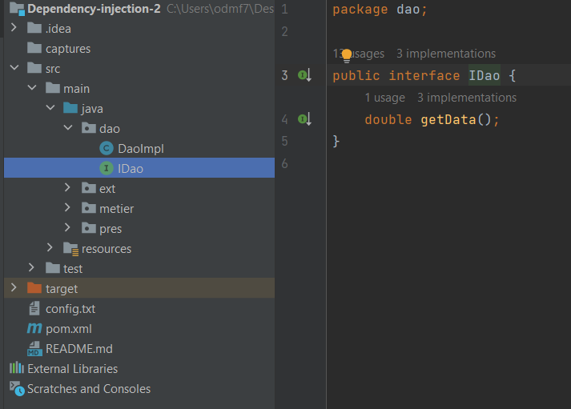
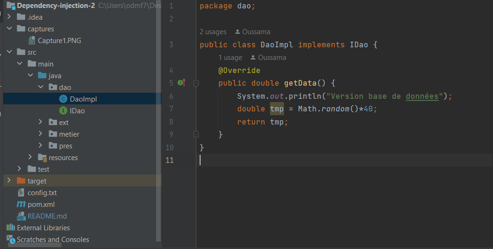
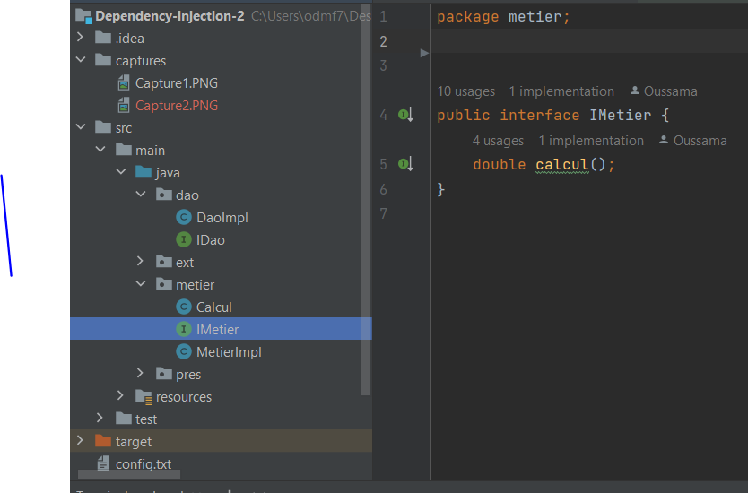
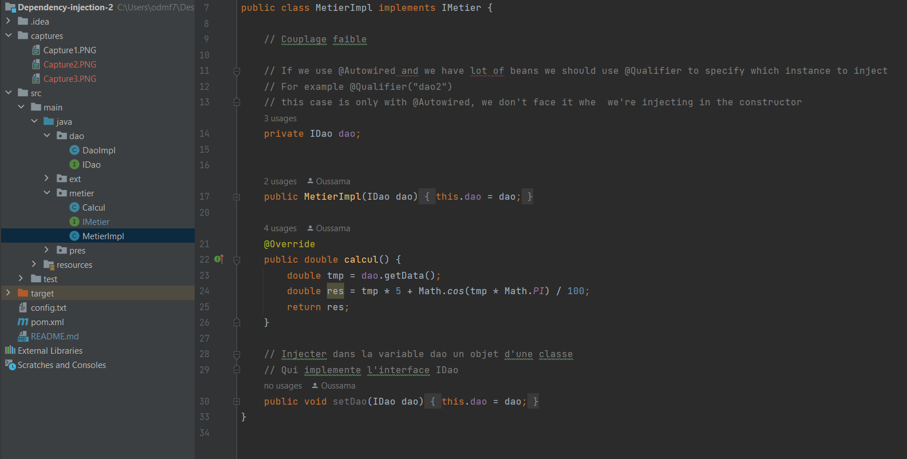
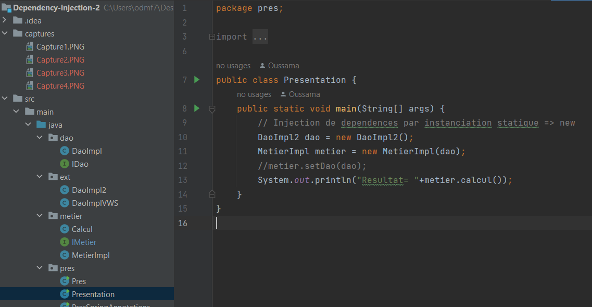
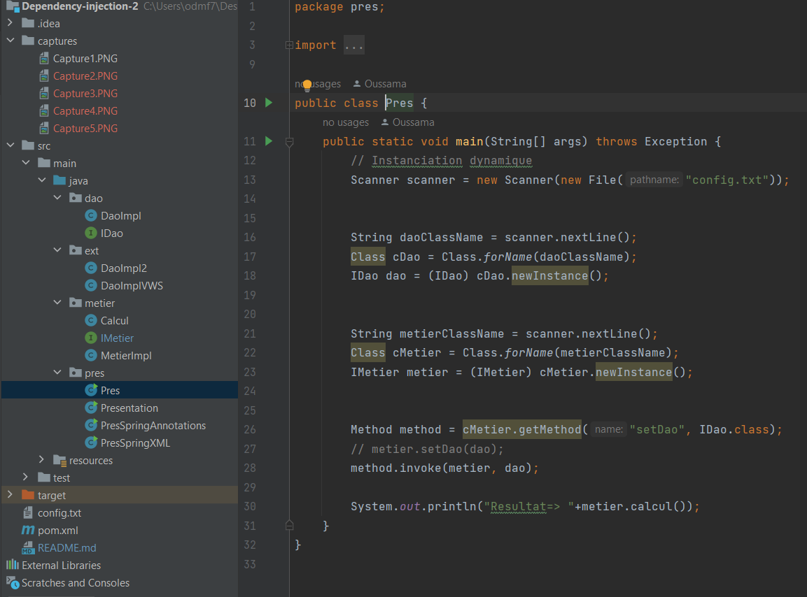
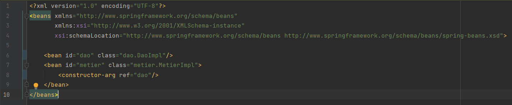
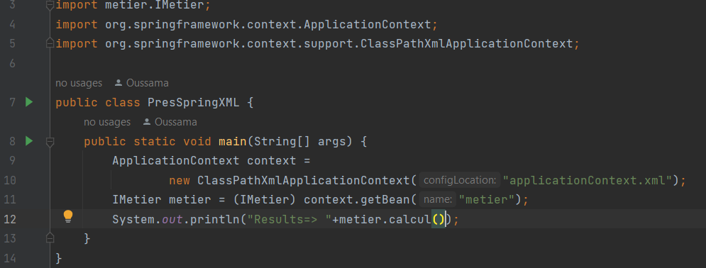
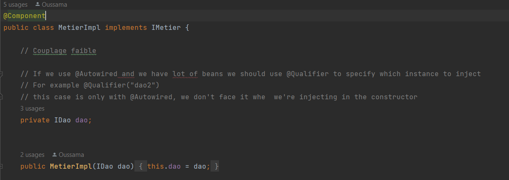
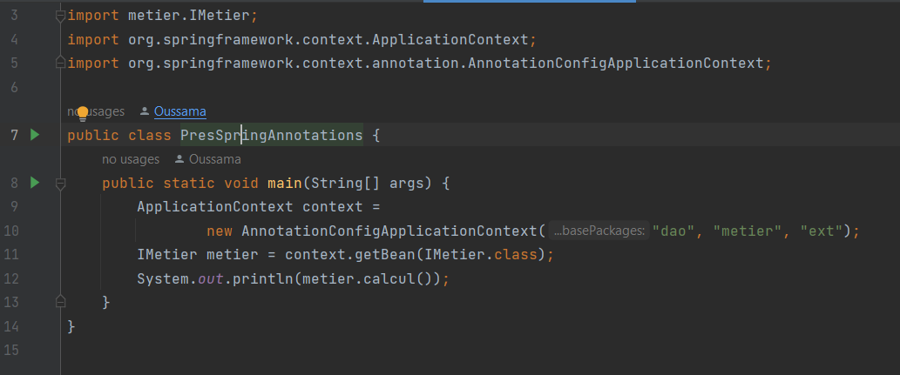

<h1>Dependency Injection</h1>

 
<h3>1. Créer l'interface IDao avec une méthode getDate</h3>

 
<h3>2. Créer une implémentation de cette interface</h3>

 
<h3>3. Créer l'interface IMetier avec une méthode calcul</h3>

 
<h3>4. Créer une implémentation de cette interface en utilisant le couplage faible</h3>

 
<h3>5. Injection des dépendances par instanciation statique</h3>

 
<h3>6. Injection des dépendances par instanciation dynamique</h3>

 
<h3>6. Injection des dépendances En utilisant le Framework Spring version XML</h3>

 
<h3>6. Injection des dépendances En utilisant le Framework Spring version Annotations</h3>

